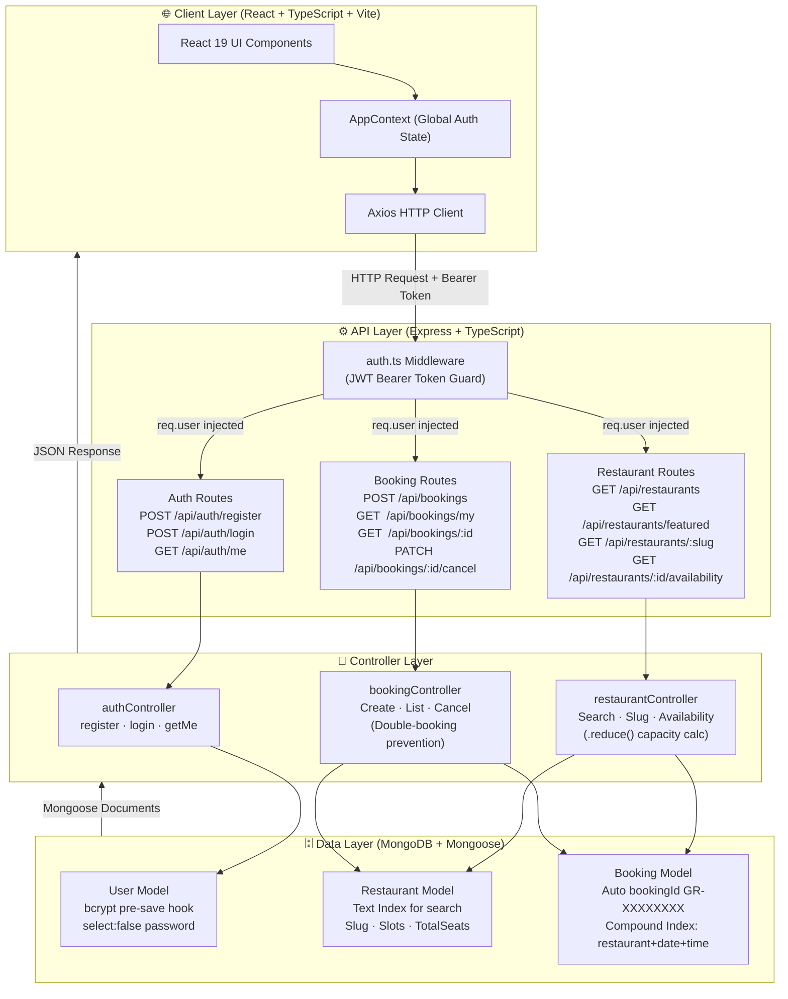
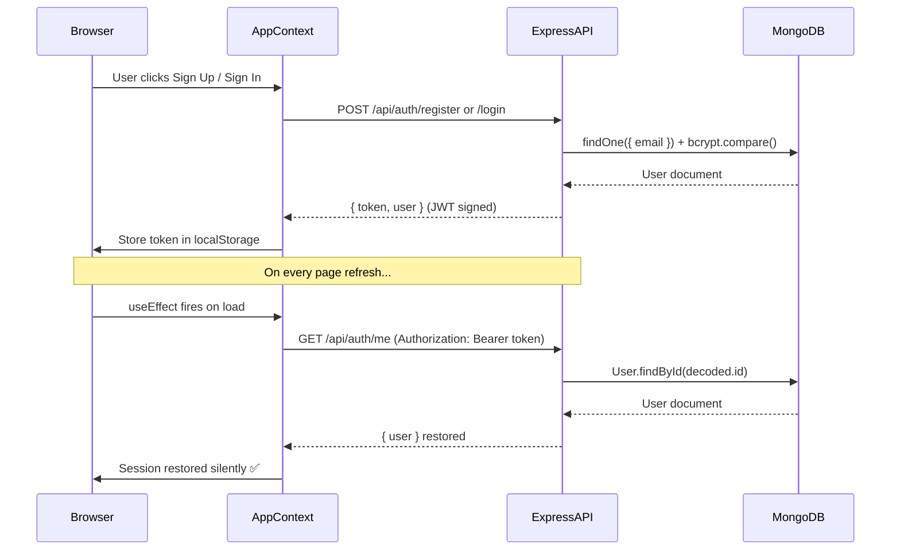
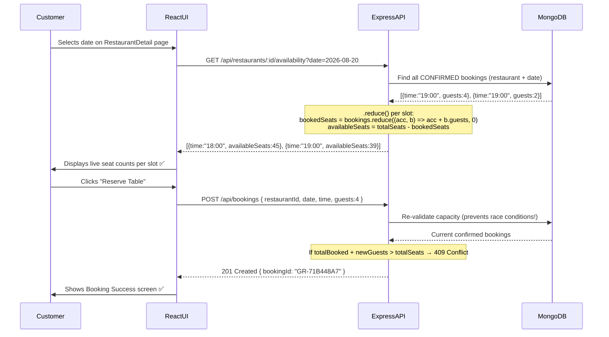

# 🍽️ QuickDine — Full Stack Restaurant Reservation Platform

<div align="center">


**A premium, production-grade MERN stack restaurant booking platform with real-time seat availability, JWT authentication, and dynamic search filtering.**

[](https://www.typescriptlang.org/)
[](https://react.dev/)
[](https://nodejs.org/)
[](https://expressjs.com/)
[](https://www.mongodb.com/)
[](https://tailwindcss.com/)

[Live Demo](#) · [Backend API Docs](#-api-reference) · [Report Bug](https://github.com/SujalDeshmukh/quickdine/issues)

</div>

---

## 📋 Table of Contents

- [Overview](#-overview)
- [System Architecture](#-system-architecture)
- [Tech Stack](#-tech-stack)
- [Folder Structure](#-folder-structure)
- [API Reference](#-api-reference)
- [Key Features](#-key-features)
- [Getting Started](#-getting-started)
- [Environment Variables](#-environment-variables)

---

## 🌟 Overview

QuickDine solves the **double-booking problem** that plagues traditional restaurant reservation systems. It implements **server-side, real-time capacity validation** using array aggregations (`.reduce()`) ensuring that the total confirmed booked seats for any time slot never exceed a restaurant's total seating capacity — preventing overbooking even under concurrent requests.

> Built as a full-stack monorepo with a **React 19 + Vite** frontend and a **Node.js + Express + MongoDB** REST API backend, both written in **TypeScript**.

---

## 🏗️ System Architecture



---

### 🔐 Authentication & Session Flow



---

### ⚡ Real-Time Slot Availability Flow



---

## 🛠️ Tech Stack

| Layer | Technology | Why |
| :--- | :--- | :--- |
| **Frontend Framework** | React 19 + Vite | Component-driven UI with instant HMR dev experience |
| **Frontend Language** | TypeScript | Strict type safety across component props and API contracts |
| **Styling** | Tailwind CSS v4 | Utility-first, responsive design with custom luxury theme |
| **HTTP Client** | Axios | Interceptors, default headers, and clean error handling |
| **Routing** | React Router v7 | Client-side routing with protected route guards |
| **Backend Framework** | Express.js | Minimal, flexible REST API with middleware composition |
| **Backend Language** | TypeScript | End-to-end type safety including Mongoose schemas |
| **Database** | MongoDB | Flexible NoSQL documents for nested schemas (tags, slots arrays) |
| **ODM** | Mongoose | Schema validation, indexes, and pre-save middleware hooks |
| **Authentication** | JWT + bcryptjs | Stateless auth tokens, salted password hashing (12 rounds) |
| **Runtime** | Node.js | Non-blocking I/O for concurrent reservation handling |

---

## 📁 Folder Structure

```
quickdine/                          ← Monorepo Root
│
├── frontend/                       ← React + TypeScript + Vite
│   ├── public/                     ← Static assets (restaurant images, logo)
│   ├── src/
│   │   ├── assets/assets.ts        ← Shared constants & dummy fallback data
│   │   ├── components/
│   │   │   ├── AuthModal.tsx        ← Sign In / Sign Up modal
│   │   │   ├── Navbar.tsx           ← Top navigation with user dropdown
│   │   │   ├── RestaurantCard.tsx   ← Restaurant discovery card
│   │   │   ├── booking/             ← BookingForm, BookingSummary, BookingSuccess
│   │   │   └── restaurant/          ← BookingWidget, RestaurantHero, RestaurantInfo
│   │   ├── context/
│   │   │   └── AppContext.tsx       ← Global auth state, login, register, logout
│   │   └── pages/
│   │       ├── Home.tsx             ← Landing page with featured restaurants
│   │       ├── Search.tsx           ← Dynamic search & filter page
│   │       ├── RestaurantDetail.tsx ← Detail view + real-time slot picker
│   │       ├── BookingConfirmation.tsx ← Reservation form & confirmation
│   │       └── Dashboard.tsx        ← My Bookings (upcoming + history + cancel)
│   ├── package.json
│   └── vite.config.ts
│
└── backend/                        ← Node.js + Express + TypeScript
    ├── src/
    │   ├── config/
    │   │   └── db.ts               ← MongoDB connection (fail-fast pattern)
    │   ├── models/
    │   │   ├── user.ts             ← User schema (bcrypt hook, select:false)
    │   │   ├── restaurant.ts       ← Restaurant schema (slug, slots, text index)
    │   │   └── booking.ts          ← Booking schema (auto bookingId, compound index)
    │   ├── controllers/
    │   │   ├── authController.ts   ← register, login, getMe
    │   │   ├── restaurantController.ts ← Search, slug, .reduce() availability
    │   │   └── bookingController.ts ← createBooking (capacity guard), list, cancel
    │   ├── middlewares/
    │   │   └── auth.ts             ← JWT protect guard → injects req.user
    │   ├── routes/
    │   │   ├── authRoutes.ts
    │   │   ├── restaurantRoutes.ts
    │   │   └── bookingRoutes.ts
    │   ├── seed.ts                 ← Database seeder (6 sample restaurants)
    │   └── server.ts               ← Express app entry point
    ├── .env.example
    ├── package.json
    └── tsconfig.json
```

---

## 🔌 API Reference

### 🔑 Authentication — `/api/auth`

| Method | Endpoint | Access | Description |
| :--- | :--- | :--- | :--- |
| `POST` | `/api/auth/register` | Public | Create a new customer account |
| `POST` | `/api/auth/login` | Public | Authenticate user, receive JWT |
| `GET` | `/api/auth/me` | 🔐 Private | Get current user profile (session restore) |

### 🏪 Restaurants — `/api/restaurants`

| Method | Endpoint | Access | Query Params | Description |
| :--- | :--- | :--- | :--- | :--- |
| `GET` | `/api/restaurants` | Public | `search`, `location`, `cuisine`, `priceRange`, `sort` | Search all approved restaurants |
| `GET` | `/api/restaurants/featured` | Public | — | Top-rated featured restaurants |
| `GET` | `/api/restaurants/:slug` | Public | — | Single restaurant by URL slug |
| `GET` | `/api/restaurants/:id/availability` | Public | `date` (YYYY-MM-DD) | Real-time per-slot seat availability |

### 📅 Bookings — `/api/bookings`

| Method | Endpoint | Access | Description |
| :--- | :--- | :--- | :--- |
| `POST` | `/api/bookings` | 🔐 Private | Create reservation (with `.reduce()` capacity validation) |
| `GET` | `/api/bookings/my` | 🔐 Private | All bookings for the logged-in user |
| `GET` | `/api/bookings/:id` | 🔐 Private | Single booking (ownership-checked) |
| `PATCH` | `/api/bookings/:id/cancel` | 🔐 Private | Cancel a confirmed booking |

---

## ✨ Key Features

- 🔒 **Secure Authentication** — JWT stateless auth with bcrypt password hashing (12 salt rounds). Password field hidden with `select: false` — never leaked in API responses.
- ⚡ **Real-Time Capacity Engine** — Uses JavaScript's `.reduce()` to dynamically calculate remaining seats per slot, ensuring bookings never exceed `restaurant.totalSeats`.
- 🛡️ **Double-Booking Guard** — Server re-validates capacity on every `POST /api/bookings` request, preventing race conditions under concurrent traffic.
- 🔍 **Full-Text Search** — MongoDB text indexes across `name`, `cuisine`, `location`, and `tags` for fast search-as-you-type filtering.
- 🆔 **Auto Reference Numbers** — Mongoose `pre('save')` hook generates unique human-readable booking IDs (e.g., `GR-71B448A7`).
- 🛡️ **Ownership Guards** — `Booking.findOne({ _id, user })` pattern prevents customers from accessing or cancelling other users' bookings.
- 📱 **Fully Responsive** — Mobile-first layout with a dedicated slide-in filter drawer for small screens.

---

## 🚀 Getting Started

### Prerequisites
- **Node.js** v18+
- **MongoDB** (local or [MongoDB Atlas](https://www.mongodb.com/cloud/atlas))
- **Git**

### 1. Clone the Repository

```bash
git clone https://github.com/SujalDeshmukh/quickdine.git
cd quickdine
```

### 2. Setup Backend

```bash
cd backend

# Create environment file
cp .env.example .env
# Edit .env and fill in your MONGODB_URI and JWT_SECRET

# Install dependencies
npm install

# Seed the database with 6 sample restaurants
npm run seed

# Start development server
npm run dev
# Backend runs at http://localhost:5000
```

### 3. Setup Frontend

```bash
cd ../frontend

# Install dependencies
npm install

# Start development server
npm run dev
# Frontend runs at http://localhost:5173
```

### 4. Open in Browser

Navigate to **[http://localhost:5173](http://localhost:5173)** and test the full customer journey:

1. **Register** a new account via Sign Up modal.
2. **Browse** restaurants on the Search page.
3. **Select a date** on a restaurant's detail page to see real-time slot availability.
4. **Book a table** and receive a confirmation with a unique booking reference.
5. **View and cancel** reservations from the Dashboard.

---

## 🌍 Environment Variables

### Backend (`backend/.env`)

```env
PORT=5000
MONGODB_URI=mongodb://127.0.0.1:27017/quickdine   # Or your Atlas URI
JWT_SECRET=your_super_secret_jwt_key_here
JWT_EXPIRES_IN=7d
CLIENT_URL=http://localhost:5173
```

> ⚠️ **Never commit your `.env` file!** It is listed in `.gitignore`. Use `.env.example` as a reference template.

---

## 👨‍💻 Author

**Sujal Deshmukh**

[](https://github.com/SujalDeshmukh)

---

<div align="center">

Made with ❤️ using the MERN Stack

</div>
