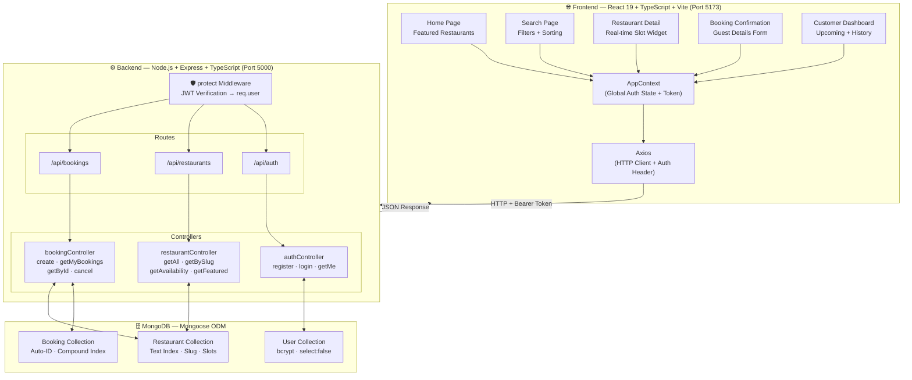
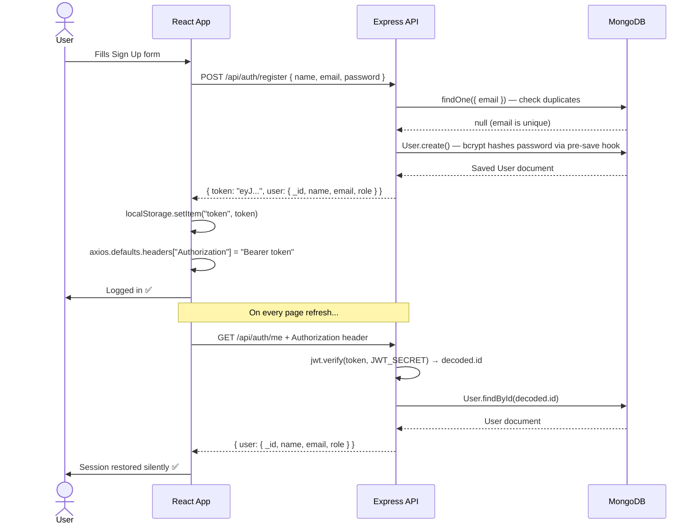
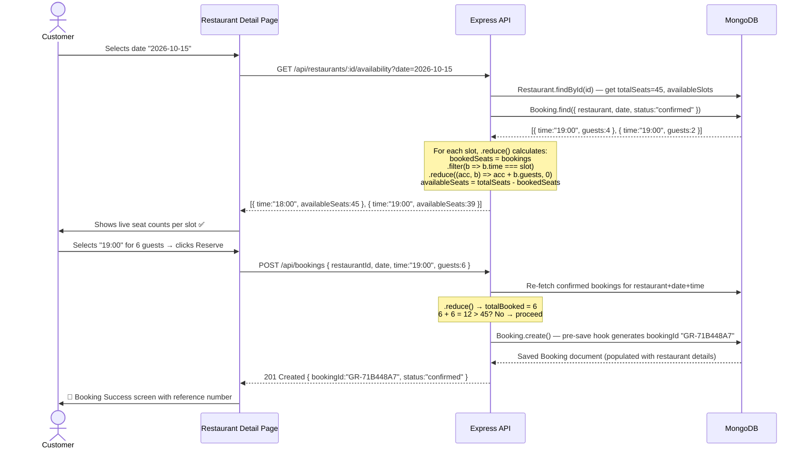

<div align="center">


# QuickDine

### 🍽️ Full Stack Multi-Restaurant Table Reservation Platform

**A premium, production-grade MERN stack application where customers can discover top-rated restaurants, check real-time table availability, make instant reservations, and manage their entire dining history — all in one seamless experience.**

<br/>

[](https://www.typescriptlang.org/)
[](https://react.dev/)
[](https://nodejs.org/)
[](https://expressjs.com/)
[](https://www.mongodb.com/)
[](https://tailwindcss.com/)
[](https://vitejs.dev/)

<br/>

[🚀 Live Demo](#) &nbsp;·&nbsp; [📖 API Docs](#-api-reference) &nbsp;·&nbsp; [🐛 Report Bug](https://github.com/SujalDeshmukh/quickdine/issues) &nbsp;·&nbsp; [✨ Request Feature](https://github.com/SujalDeshmukh/quickdine/issues)

</div>

<br/>

---

## 📸 Screenshots

| Home Page | Restaurant Search | Restaurant Detail |
|:---------:|:-----------------:|:-----------------:|
|  |  |  |

| Booking Confirmation | Customer Dashboard |
|:--------------------:|:-----------------:|
|  |  |

---

## 📋 Table of Contents

- [Project Overview](#-project-overview)
- [System Architecture](#-system-architecture)
- [Tech Stack & Justifications](#-tech-stack--justifications)
- [Folder Structure](#-folder-structure)
- [Core Features & Implementation](#-core-features--implementation)
- [API Reference](#-api-reference)
- [Database Schema](#-database-schema)
- [Authentication Flow](#-authentication-flow)
- [Getting Started](#-getting-started)
- [Environment Variables](#-environment-variables)
- [Scripts Reference](#-scripts-reference)
- [Deployment](#-deployment)

---

## 🌟 Project Overview

QuickDine solves a real-world problem: **preventing double-booking and overbooking in restaurant reservation systems**.

Traditional booking platforms often fail under concurrent load — two users might both book the last available table at the same moment. QuickDine implements **real-time, server-side capacity validation** using JavaScript's `.reduce()` array method to calculate total confirmed booked seats for any given restaurant/date/time slot before accepting a new reservation. If the combined total would exceed `restaurant.totalSeats`, the booking is rejected with a clear `409 Conflict` response.

### What makes this project stand out:

- ✅ **Server-side double-booking prevention** — capacity is re-validated on every booking creation request, not just on the frontend
- ✅ **Real-time slot availability** — seat counts update dynamically when users select a date, fetching live data from the database
- ✅ **Stateless JWT authentication** — no server-side sessions; tokens are verified per-request via middleware
- ✅ **Slug-based routing** — SEO-friendly URLs like `/restaurant/kuro-omakase` instead of exposing raw database IDs
- ✅ **Full TypeScript** — end-to-end type safety from Mongoose schemas to React component props
- ✅ **MongoDB text indexing** — fast full-text search across restaurant name, cuisine, location, and tags

---

## 🏗️ System Architecture

### High-Level Component Diagram


```mermaid
graph TB
    subgraph CLIENT["🌐 Frontend  —  React 19 + TypeScript + Vite  (Port 5173)"]
        direction TB
        HOME["Home Page\nFeatured Restaurants"]
        SEARCH["Search Page\nFilters + Sorting"]
        DETAIL["Restaurant Detail\nReal-time Slot Widget"]
        BOOKING["Booking Confirmation\nGuest Details Form"]
        DASH["Customer Dashboard\nUpcoming + History"]
        CTX["AppContext\n(Global Auth State + Token)"]
        AX["Axios\n(HTTP Client + Auth Header)"]

        HOME & SEARCH & DETAIL & BOOKING & DASH --> CTX
        CTX --> AX
    end

    subgraph SERVER["⚙️  Backend  —  Node.js + Express + TypeScript  (Port 5000)"]
        direction TB
        MW["🛡️ protect Middleware\nJWT Verification → req.user"]

        subgraph ROUTES["Routes"]
            AR["/api/auth"]
            RR["/api/restaurants"]
            BR["/api/bookings"]
        end

        subgraph CONTROLLERS["Controllers"]
            AC["authController\nregister · login · getMe"]
            RC["restaurantController\ngetAll · getBySlug\ngetAvailability · getFeatured"]
            BC["bookingController\ncreate · getMyBookings\ngetById · cancel"]
        end

        MW --> AR & RR & BR
        AR --> AC
        RR --> RC
        BR --> BC
    end

    subgraph DATABASE["🗄️  MongoDB  —  Mongoose ODM"]
        UM["User Collection\nbcrypt · select:false"]
        RM["Restaurant Collection\nText Index · Slug · Slots"]
        BM["Booking Collection\nAuto-ID · Compound Index"]
    end

    AX -->|"HTTP + Bearer Token"| SERVER
    AC <--> UM
    RC <--> RM
    BC <--> BM & RM
    SERVER -->|"JSON Response"| CLIENT
```

---

### Authentication & Session Flow


```mermaid
sequenceDiagram
    actor User
    participant React as React App
    participant API as Express API
    participant DB as MongoDB

    User->>React: Fills Sign Up form
    React->>API: POST /api/auth/register { name, email, password }
    API->>DB: findOne({ email }) — check duplicates
    DB-->>API: null (email is unique)
    API->>DB: User.create() — bcrypt hashes password via pre-save hook
    DB-->>API: Saved User document
    API-->>React: { token: "eyJ...", user: { _id, name, email, role } }
    React->>React: localStorage.setItem("token", token)
    React->>React: axios.defaults.headers["Authorization"] = "Bearer token"
    React->>User: Logged in ✅

    Note over React,API: On every page refresh...

    React->>API: GET /api/auth/me + Authorization header
    API->>API: jwt.verify(token, JWT_SECRET) → decoded.id
    API->>DB: User.findById(decoded.id)
    DB-->>API: User document
    API-->>React: { user: { _id, name, email, role } }
    React->>User: Session restored silently ✅
```

---

### Real-Time Slot Availability & Booking Flow


```mermaid
sequenceDiagram
    actor Customer
    participant UI as Restaurant Detail Page
    participant API as Express API
    participant DB as MongoDB

    Customer->>UI: Selects date "2026-10-15"
    UI->>API: GET /api/restaurants/:id/availability?date=2026-10-15
    API->>DB: Restaurant.findById(id) — get totalSeats=45, availableSlots
    API->>DB: Booking.find({ restaurant, date, status:"confirmed" })
    DB-->>API: [{ time:"19:00", guests:4 }, { time:"19:00", guests:2 }]

    Note over API: For each slot, .reduce() calculates:<br/>bookedSeats = bookings<br/>  .filter(b => b.time === slot)<br/>  .reduce((acc, b) => acc + b.guests, 0)<br/>availableSeats = totalSeats - bookedSeats

    API-->>UI: [{ time:"18:00", availableSeats:45 }, { time:"19:00", availableSeats:39 }]
    UI->>Customer: Shows live seat counts per slot ✅

    Customer->>UI: Selects "19:00" for 6 guests → clicks Reserve
    UI->>API: POST /api/bookings { restaurantId, date, time:"19:00", guests:6 }
    API->>DB: Re-fetch confirmed bookings for restaurant+date+time
    Note over API: .reduce() → totalBooked = 6<br/>6 + 6 = 12 > 45? No → proceed

    API->>DB: Booking.create() — pre-save hook generates bookingId "GR-71B448A7"
    DB-->>API: Saved Booking document (populated with restaurant details)
    API-->>UI: 201 Created { bookingId:"GR-71B448A7", status:"confirmed" }
    UI->>Customer: 🎉 Booking Success screen with reference number
```

---

## 🛠️ Tech Stack & Justifications

### Frontend

| Technology | Version | Why We Chose It |
|:-----------|:-------:|:----------------|
| **React** | 19 | Industry-standard component-driven UI library. Hooks (`useState`, `useEffect`, `useContext`) manage all local and global state efficiently. |
| **TypeScript** | 5.x | Adds compile-time type safety across all component props, API response shapes, and context values — preventing entire classes of runtime bugs. |
| **Vite** | 8.x | Blazing-fast dev server with instant HMR (Hot Module Replacement). Replaces slow legacy Create-React-App/Webpack setups. |
| **Tailwind CSS** | 4.x | Utility-first CSS enables rapid responsive design directly in JSX. Custom theme colors (`primary`, `secondary`, `surface`) defined once and reused everywhere. |
| **React Router** | v7 | Client-side routing with `<Routes>`, `<Route>`, and a custom `<ProtectedRoute>` wrapper that redirects unauthenticated users. |
| **Axios** | 1.x | More powerful than `fetch`: supports request/response interceptors, default base URL and auth headers, and clean error response shape via `error.response.data`. |
| **React Hot Toast** | 2.x | Lightweight, beautiful toast notification library for success/error feedback without heavy UI dependencies. |
| **Lucide React** | latest | Consistent, tree-shakeable SVG icon library that matches the platform's premium aesthetic. |

### Backend

| Technology | Version | Why We Chose It |
|:-----------|:-------:|:----------------|
| **Node.js** | 18+ | Event-driven, non-blocking I/O runtime ideal for handling many concurrent API requests (e.g., multiple users checking availability simultaneously). |
| **Express.js** | 4.x | Minimal, unopinionated REST framework. Middleware composition pattern (`protect → controller`) maps cleanly to our security model. |
| **TypeScript** | 5.x | End-to-end type safety: Mongoose documents typed via interfaces (`IUser`, `IRestaurant`, `IBooking`), controller `req`/`res` types enforced. |
| **MongoDB** | 8.x | NoSQL document model fits our data naturally: `availableSlots: string[]` and `tags: string[]` are stored as native arrays. Horizontal scaling for future growth. |
| **Mongoose** | 8.x | ODM providing schema validation, pre/post save hooks (for password hashing and bookingId generation), and populate() for joining collections. |
| **JSON Web Tokens** | 9.x | Stateless authentication: server signs a token on login, client stores and sends it on every private request. No server-side session storage needed. |
| **Bcryptjs** | 2.x | Industry-standard password hashing. Salt factor of 12 means each hash takes ~250ms to compute — fast enough for UX, slow enough to defeat brute-force. |
| **dotenv** | 16.x | Loads `.env` file into `process.env` at startup, keeping secrets out of source code. |
| **cors** | 2.x | Configures CORS headers to allow only the frontend origin (`CLIENT_URL`) to call the API, blocking cross-origin abuse. |

---

## 📁 Folder Structure

```
quickdine/                               ← Monorepo Root
│
├── .gitattributes                       ← Forces LF line endings (fixes Windows CRLF warnings)
├── .gitignore                           ← Ignores node_modules, dist, .env in both sub-projects
├── README.md                            ← You are here 📍
│
├── frontend/                            ← React 19 + TypeScript + Vite
│   ├── public/                          ← Static assets served at root URL
│   │   ├── logo.svg
│   │   ├── favicon.svg
│   │   └── restaurant_*.png/jpg         ← Restaurant images
│   ├── src/
│   │   ├── main.tsx                     ← App entry point (ReactDOM.createRoot)
│   │   ├── App.tsx                      ← Route definitions + ProtectedRoute wrappers
│   │   ├── index.css                    ← Global styles + Tailwind directives
│   │   │
│   │   ├── assets/
│   │   │   └── assets.ts               ← Image imports + static constant exports
│   │   │
│   │   ├── context/
│   │   │   └── AppContext.tsx           ← Global auth state (user, token, login, register, logout)
│   │   │
│   │   ├── components/
│   │   │   ├── AuthModal.tsx            ← Sign In / Sign Up modal (calls AppContext)
│   │   │   ├── Navbar.tsx               ← Top nav with user dropdown + mobile menu
│   │   │   ├── Footer.tsx               ← Site footer with links
│   │   │   ├── Loader.tsx               ← Full-screen loading spinner
│   │   │   ├── ProtectedRoute.tsx       ← Route guard (redirects to home if not authed)
│   │   │   ├── RestaurantCard.tsx       ← Restaurant summary card for grid/list views
│   │   │   ├── booking/
│   │   │   │   ├── BookingForm.tsx      ← Guest details input form
│   │   │   │   ├── BookingSummary.tsx   ← Reservation summary sidebar
│   │   │   │   └── BookingSuccess.tsx   ← Post-booking success screen with reference ID
│   │   │   ├── home/
│   │   │   │   ├── Hero.tsx             ← Full-screen hero with search bar
│   │   │   │   ├── CuisineBrowse.tsx    ← Cuisine category quick-filter pills
│   │   │   │   ├── TrendingRow.tsx      ← Horizontally scrollable featured restaurants
│   │   │   │   ├── MembershipSection.tsx
│   │   │   │   └── NewsletterCTA.tsx
│   │   │   └── restaurant/
│   │   │       ├── BookingWidget.tsx    ← Date picker + guest selector + live slot grid
│   │   │       ├── RestaurantHero.tsx   ← Full-width restaurant cover image
│   │   │       ├── RestaurantInfo.tsx   ← Description, chef, tags, address
│   │   │       └── RestaurantReviews.tsx
│   │   │
│   │   └── pages/
│   │       ├── Home.tsx                 ← Landing page
│   │       ├── Search.tsx               ← Search + filter + sort results page
│   │       ├── RestaurantDetail.tsx     ← Restaurant page (info + booking widget)
│   │       ├── BookingConfirmation.tsx  ← Booking form + submission
│   │       └── Dashboard.tsx            ← My Bookings (upcoming + history + cancel)
│   │
│   ├── index.html
│   ├── vite.config.ts
│   ├── tsconfig.json
│   └── package.json
│
└── backend/                             ← Node.js + Express + TypeScript
    ├── src/
    │   ├── server.ts                    ← Express app setup, CORS, routes, health check
    │   ├── seed.ts                      ← Database seeder (6 sample restaurants + test user)
    │   │
    │   ├── config/
    │   │   └── db.ts                   ← MongoDB connection with fail-fast error handling
    │   │
    │   ├── models/
    │   │   ├── user.ts                  ← User schema + bcrypt pre-save + comparePassword()
    │   │   ├── restaurant.ts            ← Restaurant schema + text index + slug unique index
    │   │   └── booking.ts               ← Booking schema + auto bookingId + compound index
    │   │
    │   ├── controllers/
    │   │   ├── authController.ts        ← register, login, getMe
    │   │   ├── restaurantController.ts  ← getRestaurants, getBySlug, getAvailability, getFeatured
    │   │   └── bookingController.ts     ← createBooking (.reduce()), getMyBookings, cancel, getById
    │   │
    │   ├── middlewares/
    │   │   └── auth.ts                  ← JWT protect middleware → injects req.user
    │   │
    │   └── routes/
    │       ├── authRoutes.ts
    │       ├── restaurantRoutes.ts
    │       └── bookingRoutes.ts
    │
    ├── .env.example                     ← Environment variable template
    ├── .gitignore
    ├── tsconfig.json
    └── package.json
```

---

## ✨ Core Features & Implementation

### 1. 🔐 Secure Authentication

**Password Hashing** — Bcrypt runs via a Mongoose `pre('save')` hook so passwords are *always* hashed before reaching the database, even if someone calls `user.save()` directly:

```typescript
// backend/src/models/user.ts
userSchema.pre("save", async function (next) {
  if (!this.isModified("password")) return next(); // Skip if password unchanged
  this.password = await bcrypt.hash(this.password, 12); // 12 salt rounds
  next();
});
```

**JWT Guard Middleware** — Every private route passes through `protect` before reaching its controller:

```typescript
// backend/src/middlewares/auth.ts
export const protect = async (req, res, next) => {
  const token = req.headers.authorization?.split(" ")[1]; // Extract Bearer token
  if (!token) return res.status(401).json({ message: "Not authorized" });

  const decoded = jwt.verify(token, process.env.JWT_SECRET) as { id: string };
  req.user = await User.findById(decoded.id); // Attach user to request
  next();
};
```

**Session Restore** — On every app load, `AppContext` calls `/api/auth/me` to silently restore the logged-in user from a stored token:

```typescript
// frontend/src/context/AppContext.tsx
useEffect(() => {
  if (token) {
    axios.defaults.headers.common["Authorization"] = `Bearer ${token}`;
    axios.get("/api/auth/me").then(({ data }) => setUser(data.user));
  }
}, [token]);
```

---

### 2. ⚡ Real-Time Slot Availability with `.reduce()`

The core algorithm that powers the live seat availability display:

```typescript
// backend/src/controllers/restaurantController.ts — getSlotAvailability()

// Step 1: Get all confirmed bookings for this restaurant on this date
const bookingsOnDate = await Booking.find({
  restaurant: id,
  date: { $gte: startOfDay, $lte: endOfDay },
  status: "confirmed",
});

// Step 2: For each time slot, calculate how many seats are already taken
const slotsAvailability = restaurant.availableSlots.map((slotTime) => {

  // .reduce() iterates ALL bookings and accumulates guests for this slot only
  const bookedSeats = bookingsOnDate.reduce((total, booking) => {
    return booking.time === slotTime ? total + booking.guests : total;
  }, 0); // Accumulator starts at 0

  return {
    time: slotTime,
    availableSeats: Math.max(0, restaurant.totalSeats - bookedSeats),
    isAvailable: restaurant.totalSeats - bookedSeats > 0,
  };
});
```

**Why `.reduce()` and not `.filter().length`?**
We need to sum the `guests` field across bookings — a group of 4 friends counts as 4 seats, not 1 booking. `.reduce()` lets us accumulate the actual guest count in a single pass over the array (O(n) time complexity).

---

### 3. 🛑 Double-Booking Prevention

The same capacity check runs again inside `createBooking` — even if the frontend shows seats available, the backend re-validates to prevent race conditions when two users book simultaneously:

```typescript
// backend/src/controllers/bookingController.ts — createBooking()

const existingBookings = await Booking.find({
  restaurant: restaurantId,
  date: { $gte: startOfDay, $lte: endOfDay },
  time: time,
  status: "confirmed",
});

// .reduce() sums all currently confirmed guests for this slot
const totalBookedSeats = existingBookings.reduce(
  (acc, booking) => acc + booking.guests,
  0
);

if (totalBookedSeats + requestedGuests > restaurant.totalSeats) {
  return res.status(409).json({
    message: `Only ${restaurant.totalSeats - totalBookedSeats} seats remaining`,
  });
}
// → Only then is the booking created ✅
```

---

### 4. 🔍 Dynamic Restaurant Search

Query parameters from the URL are converted into a Mongoose filter object dynamically:

```typescript
// backend/src/controllers/restaurantController.ts — getRestaurants()

const filter: Record<string, unknown> = { status: "approved" }; // Always filter

if (search)     filter.$text = { $search: search };            // MongoDB text index
if (location)   filter.location = { $regex: location, $options: "i" }; // Case-insensitive
if (cuisine)    filter.cuisine = { $in: cuisineArray };        // Multi-select
if (priceRange) filter.priceRange = { $in: priceArray };       // Multi-select

let query = Restaurant.find(filter);

if (sort === "price_low")  query = query.sort({ priceRange: 1 });
if (sort === "price_high") query = query.sort({ priceRange: -1 });
else                       query = query.sort({ createdAt: -1 }); // Default: newest
```

---

### 5. 🆔 Auto-Generated Booking Reference Numbers

Every booking gets a human-readable unique ID (e.g., `GR-71B448A7`) via a Mongoose `pre('save')` hook:

```typescript
// backend/src/models/booking.ts
bookingSchema.pre("save", function (next) {
  if (this.isNew && !this.bookingId) {
    const randomHex = Math.random().toString(16).substring(2, 10).toUpperCase();
    this.bookingId = `GR-${randomHex}`; // e.g., GR-71B448A7
  }
  next();
});
```

---

### 6. 🛡️ Ownership Security Guards

Cancellation endpoint uses a compound `findOne` query to simultaneously find the booking AND verify it belongs to the requesting user — a single query that prevents unauthorized access:

```typescript
// backend/src/controllers/bookingController.ts — cancelBooking()

// This query ONLY returns a document if BOTH conditions are true:
// 1. The booking _id matches
// 2. The booking's user field matches the authenticated user's ID
const booking = await Booking.findOne({ _id: id, user: userId });

if (!booking) {
  return res.status(404).json({
    message: "Booking not found or you are not authorized to cancel it."
  });
  // Note: We deliberately don't say which condition failed — security best practice
}
```

---

## 🔌 API Reference

**Base URL:** `http://localhost:5000/api`

**Authentication:** Private routes require `Authorization: Bearer <token>` header.

### 🔑 Auth Endpoints

```
POST   /api/auth/register     Public   Register a new customer account
POST   /api/auth/login        Public   Login and receive a JWT token
GET    /api/auth/me           Private  Get current user profile
```

<details>
<summary><strong>POST /api/auth/register</strong> — Request & Response</summary>

**Request Body:**
```json
{
  "name": "Sujal Deshmukh",
  "email": "sujal@example.com",
  "password": "securepassword123",
  "phone": "+91 9876543210",
  "role": "user"
}
```

**Response `201 Created`:**
```json
{
  "success": true,
  "message": "Account created successfully!",
  "token": "eyJhbGciOiJIUzI1NiIsInR5cCI6IkpXVCJ9...",
  "user": {
    "_id": "64f2a3c50e88c825d8873f75",
    "name": "Sujal Deshmukh",
    "email": "sujal@example.com",
    "role": "user",
    "createdAt": "2026-09-29T17:00:00.000Z"
  }
}
```
</details>

<details>
<summary><strong>POST /api/auth/login</strong> — Request & Response</summary>

**Request Body:**
```json
{
  "email": "sujal@example.com",
  "password": "securepassword123"
}
```

**Response `200 OK`:**
```json
{
  "success": true,
  "token": "eyJhbGciOiJIUzI1NiIsInR5cCI6IkpXVCJ9...",
  "user": {
    "_id": "64f2a3c50e88c825d8873f75",
    "name": "Sujal Deshmukh",
    "email": "sujal@example.com",
    "role": "user"
  }
}
```
</details>

---

### 🏪 Restaurant Endpoints

```
GET    /api/restaurants                             Public   Search all approved restaurants
GET    /api/restaurants/featured                    Public   Get top-rated featured restaurants
GET    /api/restaurants/:slug                       Public   Get restaurant by URL slug
GET    /api/restaurants/:id/availability?date=      Public   Real-time slot availability for a date
```

**Search Query Parameters** for `GET /api/restaurants`:

| Param | Type | Example | Description |
|:------|:-----|:--------|:------------|
| `search` | `string` | `Italian` | Full-text search (name, cuisine, tags) |
| `location` | `string` | `Manhattan` | Case-insensitive partial match |
| `cuisine` | `string[]` | `cuisine=French&cuisine=Japanese` | Multi-select filter |
| `priceRange` | `string[]` | `priceRange=$$$&priceRange=$$$$` | Multi-select filter |
| `sort` | `string` | `price_low` \| `price_high` | Sort order (default: newest) |

<details>
<summary><strong>GET /api/restaurants/:id/availability</strong> — Response</summary>

**Response `200 OK`:**
```json
{
  "success": true,
  "data": [
    { "time": "18:00", "availableSeats": 45, "isAvailable": true },
    { "time": "19:00", "availableSeats": 39, "isAvailable": true },
    { "time": "20:00", "availableSeats": 0,  "isAvailable": false },
    { "time": "21:00", "availableSeats": 45, "isAvailable": true }
  ]
}
```
</details>

---

### 📅 Booking Endpoints

```
POST   /api/bookings                 Private  Create a new reservation
GET    /api/bookings/my              Private  Get all bookings for logged-in user
GET    /api/bookings/:id             Private  Get single booking (ownership-checked)
PATCH  /api/bookings/:id/cancel      Private  Cancel a confirmed booking
```

<details>
<summary><strong>POST /api/bookings</strong> — Request & Response</summary>

**Request Body:**
```json
{
  "restaurantId": "64f2a3c50e88c825d8873f7d",
  "date": "2026-10-15",
  "time": "19:00",
  "guests": 4,
  "occasion": "Birthday",
  "specialRequests": "Window table preferred"
}
```

**Response `201 Created`:**
```json
{
  "success": true,
  "message": "Reservation confirmed!",
  "data": {
    "_id": "64f4e4caf866d0ae1e98e487",
    "bookingId": "GR-71B448A7",
    "restaurant": {
      "name": "L'Essence",
      "location": "Manhattan, NY",
      "image": "/restaurant_5.png"
    },
    "date": "2026-10-15T00:00:00.000Z",
    "time": "19:00",
    "guests": 4,
    "occasion": "Birthday",
    "status": "confirmed"
  }
}
```

**Error `409 Conflict` (slot full):**
```json
{
  "success": false,
  "message": "Only 2 seats remaining in the 19:00 slot."
}
```
</details>

---

### 🏥 Health Check

```
GET    /api/health    Public   Check if the server is running
```

**Response:**
```json
{
  "success": true,
  "message": "QuickDine API is running! 🍽️",
  "timestamp": "2026-09-29T17:00:00.000Z"
}
```

---

## 🗄️ Database Schema

### User Collection

```typescript
{
  _id:       ObjectId,
  name:      String,   // required, max 100 chars
  email:     String,   // required, unique, lowercase
  password:  String,   // required, select: false, bcrypt hashed
  phone:     String,   // optional
  role:      "user" | "owner" | "admin",  // default: "user"
  createdAt: Date,
  updatedAt: Date
}
```

### Restaurant Collection

```typescript
{
  _id:            ObjectId,
  name:           String,         // required
  slug:           String,         // required, unique (e.g., "kuro-omakase")
  description:    String,         // required
  cuisine:        String,         // required
  priceRange:     "$"|"$$"|"$$$"|"$$$$",
  rating:         Number,         // 0–5, default 0
  reviewCount:    Number,
  location:       String,         // e.g., "Manhattan, NY"
  address:        String,         // full street address
  image:          String,         // URL path
  chef:           String,
  tags:           [String],       // e.g., ["Romantic", "Candlelit"]
  availableSlots: [String],       // e.g., ["18:00", "19:00", "20:00"]
  featured:       Boolean,
  exclusive:      Boolean,
  owner:          ObjectId,       // ref: "User"
  status:         "pending"|"approved"|"rejected",  // default: "pending"
  totalSeats:     Number,         // required, min: 1
  createdAt:      Date,
  updatedAt:      Date
}

// Indexes:
// Text index: { name, cuisine, location, tags }
// Unique index: { slug }
```

### Booking Collection

```typescript
{
  _id:             ObjectId,
  bookingId:       String,      // Auto-generated: "GR-71B448A7" (unique)
  user:            ObjectId,    // ref: "User"
  restaurant:      ObjectId,    // ref: "Restaurant"
  date:            Date,        // reservation date
  time:            String,      // e.g., "19:00"
  guests:          Number,      // 1–20
  occasion:        String,      // optional
  specialRequests: String,      // optional
  status:          "confirmed"|"cancelled"|"completed",  // default: "confirmed"
  createdAt:       Date,
  updatedAt:       Date
}

// Indexes:
// Compound index: { restaurant, date, time }  ← Powers availability queries
// Single index:   { user }                    ← Powers "My Bookings" queries
```

---

## 🚀 Getting Started

### Prerequisites

- **Node.js** v18 or higher → [Download](https://nodejs.org/)
- **MongoDB** — either:
  - Local: [MongoDB Community Server](https://www.mongodb.com/try/download/community)
  - Cloud: [MongoDB Atlas](https://www.mongodb.com/cloud/atlas) (free tier available)
- **Git** → [Download](https://git-scm.com/)

---

### Step 1 — Clone the Repository

```bash
git clone https://github.com/SujalDeshmukh/quickdine.git
cd quickdine
```

---

### Step 2 — Configure the Backend

```bash
cd backend

# Copy the environment template
cp .env.example .env
```

Open `backend/.env` and fill in your values:

```env
PORT=5000
MONGODB_URI=mongodb://127.0.0.1:27017/quickdine   # OR your Atlas URI
JWT_SECRET=replace_this_with_a_long_random_string
JWT_EXPIRES_IN=7d
CLIENT_URL=http://localhost:5173
```

```bash
# Install backend dependencies
npm install

# Seed the database with 6 approved restaurants + 1 test user
npm run seed
```

> After seeding you will see:
> ```
> ✅ MongoDB connected: 127.0.0.1
> 🧹 Clearing old data...
> 👤 Creating test customer user...
> 🏪 Seeding restaurants...
> ✅ Database successfully seeded with 6 approved restaurants!
> 🔑 Test Login Email: testuser@example.com
> 🔑 Test Login Password: password123
> ```

```bash
# Start the backend development server (auto-restarts on file changes)
npm run dev
```

Backend is now running at **http://localhost:5000**

---

### Step 3 — Configure the Frontend

Open a **new terminal window**:

```bash
cd frontend

# Install frontend dependencies
npm install

# Start the frontend development server
npm run dev
```

Frontend is now running at **http://localhost:5173**

---

### Step 4 — Test the Application

Open **[http://localhost:5173](http://localhost:5173)** in your browser and walk through the full customer journey:

| Step | Action | What to Verify |
|:----:|:-------|:---------------|
| 1 | Click **Sign Up** → Fill in name, email, password | User is logged in, name appears in navbar |
| 2 | Go to **Restaurants** page → Type `"French"` in search | Only French restaurants appear in results |
| 3 | Click on `L'Essence` → Select today's date | Live seat counts appear for each time slot |
| 4 | Select `19:00` → Click **Reserve Table** → Fill form | Booking confirmed with reference `GR-XXXXXXXX` |
| 5 | Go to **My Bookings** (navbar) | New booking appears under Upcoming Reservations |
| 6 | Click **Cancel** on the booking | Status changes to `cancelled` |
| 7 | Go back to `L'Essence` → Same date → `19:00` | Available seats have increased again ✅ |

---

## 🌍 Environment Variables

### Backend (`backend/.env`)

| Variable | Required | Default | Description |
|:---------|:--------:|:-------:|:------------|
| `PORT` | No | `5000` | Express server port |
| `MONGODB_URI` | **Yes** | — | MongoDB connection string (local or Atlas) |
| `JWT_SECRET` | **Yes** | — | Long random string used to sign JWT tokens |
| `JWT_EXPIRES_IN` | No | `7d` | Token lifetime (e.g., `7d`, `24h`, `3600`) |
| `CLIENT_URL` | No | `http://localhost:5173` | Frontend URL for CORS header |

> ⚠️ **Security:** Never commit your `.env` file to Git. It is already listed in `.gitignore`. Use `.env.example` as a reference template for your team.

---

## 📜 Scripts Reference

### Backend (`cd backend`)

| Script | Command | Description |
|:-------|:--------|:------------|
| Development | `npm run dev` | Start server with ts-node-dev (hot reload) |
| Seed DB | `npm run seed` | Populate MongoDB with sample restaurants & test user |
| Build | `npm run build` | Compile TypeScript to JavaScript in `/dist` |
| Production | `npm start` | Run the compiled JavaScript server |

### Frontend (`cd frontend`)

| Script | Command | Description |
|:-------|:--------|:------------|
| Development | `npm run dev` | Start Vite dev server at localhost:5173 |
| Build | `npm run build` | Create optimized production build in `/dist` |
| Preview | `npm run preview` | Preview the production build locally |
| Lint | `npm run lint` | Run ESLint type checking |

---


## 👨‍💻 Author

**Sujal Deshmukh**

[](https://github.com/SujalDeshmukh)

---

## 📄 License

This project is open source and available under the [MIT License](./frontend/LICENSE.md).

---

<div align="center">


</div>
